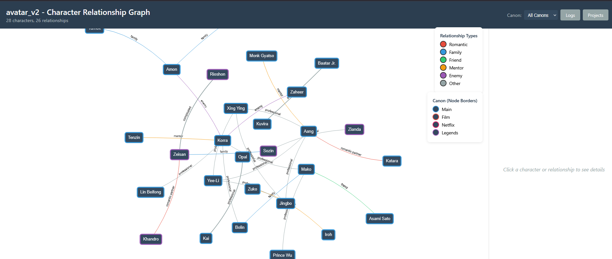
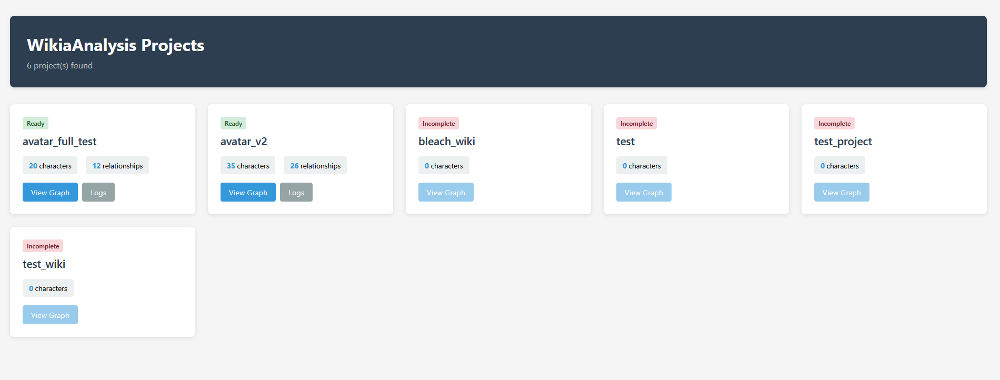
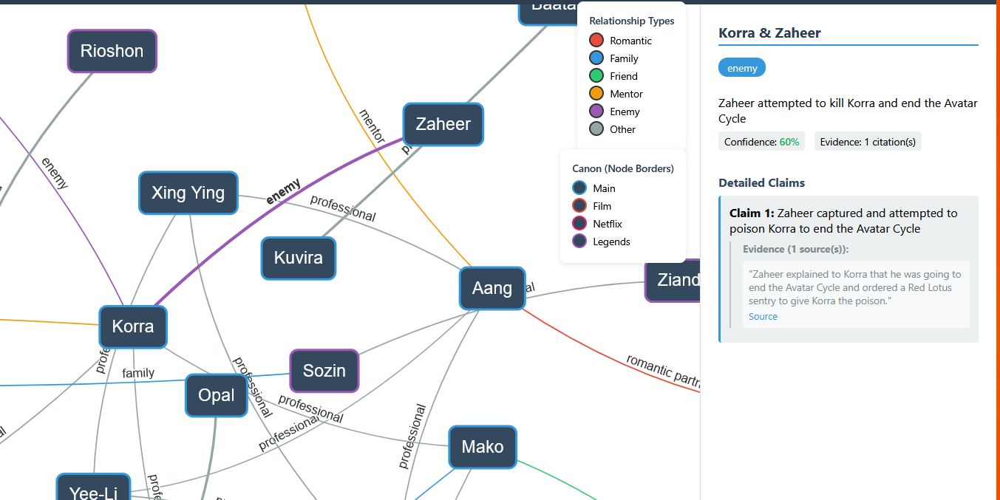

# Wikia Character Relationship Analyzer

A tool that crawls Fandom/Wikia sites, extracts character information using LLM-powered analysis, and visualizes character relationship networks.

## Screenshots

### Interactive Relationship Graph

*Force-directed graph showing character relationships with evidence-backed connections*

### Project Dashboard

*Web dashboard for browsing analyzed wikia projects*

### Evidence Viewer

*Click any relationship to view supporting citations from the wiki*

## Features

- **Ethical Web Crawling** - Rate limiting, robots.txt compliance, and domain validation
- **RAG-Powered Analysis** - ChromaDB vector database + Claude LLM for intelligent character discovery
- **Evidence Tracking** - Every relationship claim includes source URLs and supporting quotes
- **Interactive Visualization** - D3.js force-directed graphs with zoom, pan, and click-to-inspect
- **Resumable Operations** - Crawling and discovery can be interrupted and resumed
- **Multi-Canon Support** - Handles alternate universes and different story continuities

## Quick Start

```bash
# Install
pip install -e ".[dev,llm,viz]"

# Set API keys
export ANTHROPIC_API_KEY="your-key"
export VOYAGE_API_KEY="your-key"

# Run full pipeline on any Fandom wiki
python main.py pipeline my_project https://avatar.fandom.com/wiki/Aang --max-pages 100

# Or run steps individually
python main.py crawl my_project https://avatar.fandom.com/wiki/Aang --max-pages 100
python main.py index my_project
python main.py discover my_project

# Launch visualization dashboard
python src/visualizer/server.py 8000
# Visit: http://localhost:8000/
```

## How It Works

1. **Crawl** - Extracts content from Fandom/Wikia pages, parsing infoboxes and filtering navigation elements
2. **Index** - Chunks pages and generates embeddings (Voyage AI) stored in ChromaDB
3. **Discover** - LLM analyzes pages using RAG, autonomously calling tools to build a knowledge base of characters and relationships
4. **Visualize** - Generates an interactive graph from the extracted relationships

## Project Structure

```
data/projects/<name>/
  processed/      # Crawled pages (JSON)
  characters/     # Discovered character profiles
  relationships/  # Character relationships with evidence
  cache/          # ChromaDB vector store
```

## Technology Stack

- **Python 3.13+** with async I/O
- **BeautifulSoup4 + aiohttp** for web crawling
- **ChromaDB + Voyage AI** for vector search
- **Anthropic Claude** for LLM analysis
- **Flask + D3.js** for visualization
- **pytest** with 600+ unit tests

## Configuration

Configuration files in `config/`:
- `crawler_config.yaml` - Crawling settings (rate limits, user agent)
- `processor_config.yaml` - RAG and LLM settings
- `rate_limits.yaml` - Per-domain rate limiting

## Documentation

- [Architecture Details](docs/ARCHITECTURE.md)
- [Data Schemas](docs/DATA_SCHEMAS.md)
- [Development Guide](docs/DEVELOPMENT.md)
- [Logging Strategy](docs/LOGGING_STRATEGY.md)

## Contributing

```bash
# Run tests
python -m pytest -m unit -v

# Format code
black src/ tests/
isort src/ tests/

# Type checking
mypy src/
```

## License

MIT License
